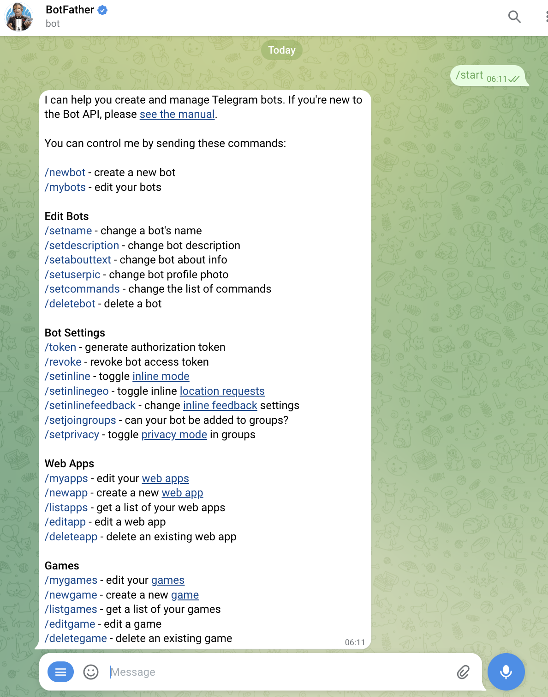
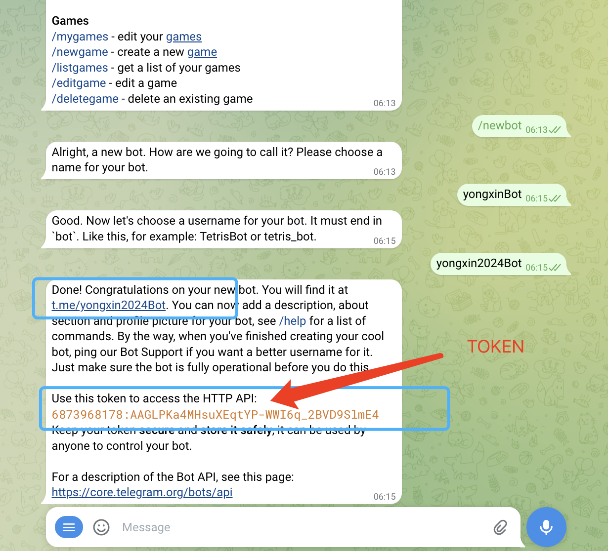

# 亿贝元宇宙科技

### 飞机 telegram 免费申请自己的专属机器人

    1.在飞机里面首页搜索框，搜索飞机机器人的爸爸 ->  @BotFather
    2.搜索到 @BotFather 后 给他发消息 /start
    3.机器人会回复你下面的消息内容
    4.然后点击 /newbot 或者直接发送 这个命令给机器人爸爸
    5.然后给你的机器人起一个名字 比如testBot ； 必须是以Bot或者_bot 结尾后缀 。
    6.然后你的机器人就创建成功了 机器人爸爸会发送给你一个你的机器人Token的 保存好这个token发给技术进行开发就可以了

