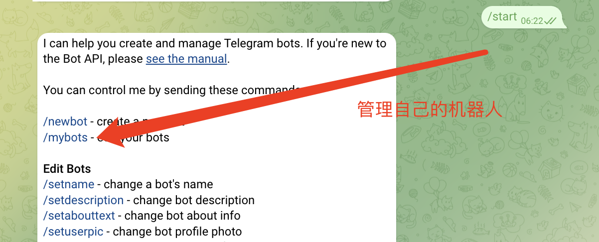
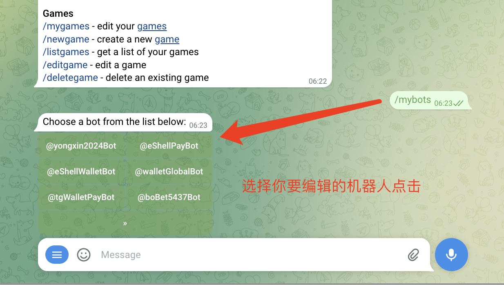
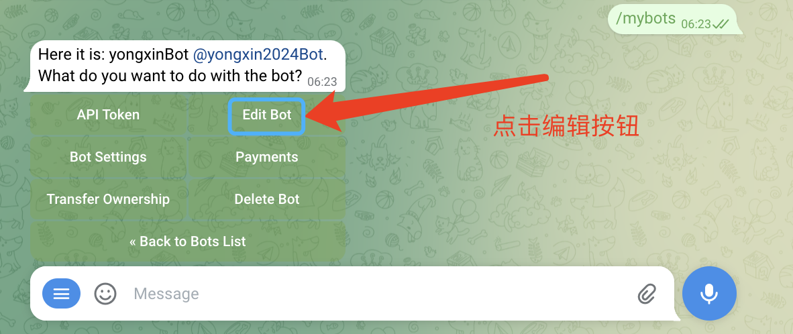
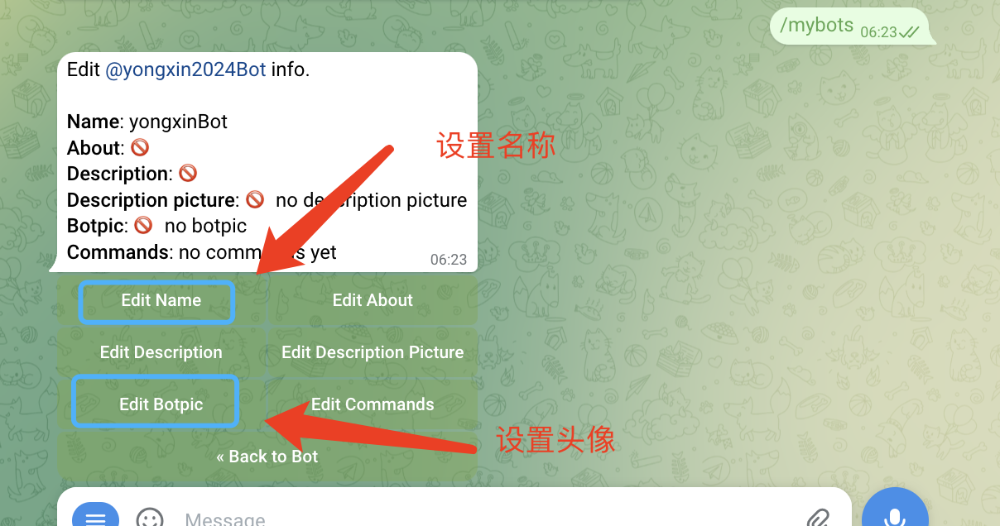
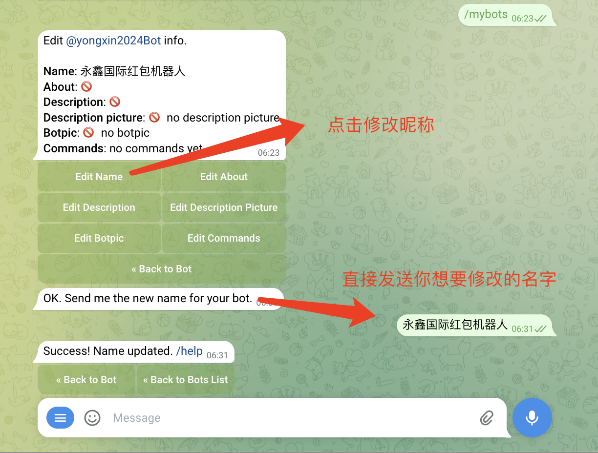
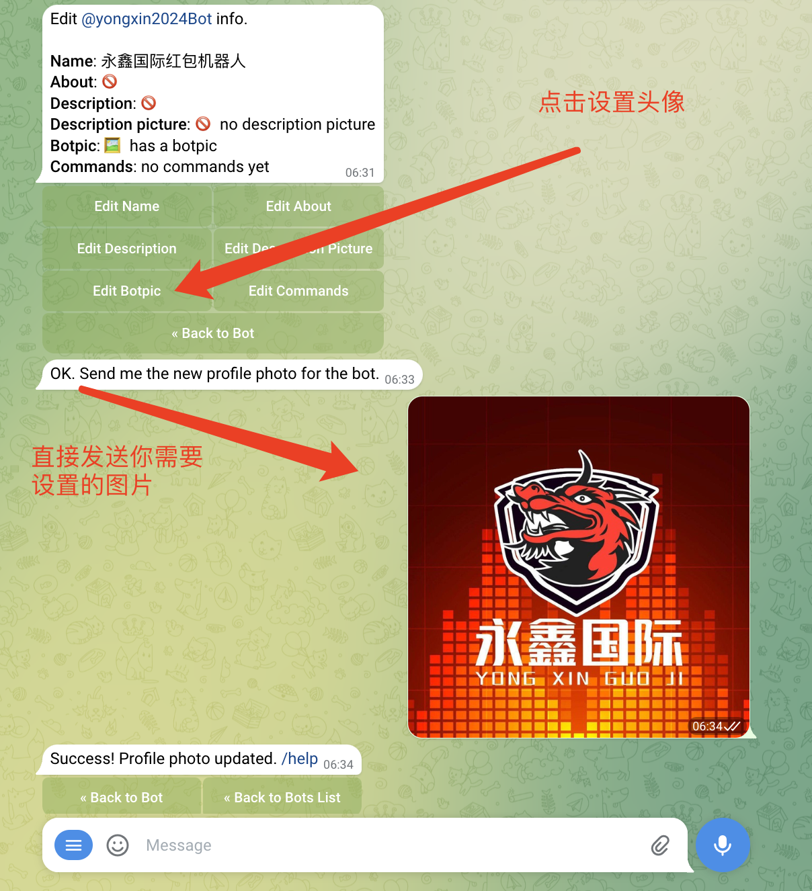

# 亿贝元宇宙科技

# 更改机器人头像
    
    1.想要更改自己的机器人头像 还是找机器人爸爸：  @BotFather 
    2.给机器人爸爸发消息 /start
    3.机器人爸爸会回复你一些命令 ；点击命令行第二个命令 /mybots 或者直接给他发 /mybots 也可以
    4.机器人爸爸会发送给你一些属于你自己的机器人的按钮 。 点击你想要编辑的机器人
    5.然后点击编辑机器人按钮
    6.点击你需要设置的选项 比如设置昵称 点击 EditName     然后直接发你修改的名字
    7.点击你需要设置的选项 比如设置头像 点击 EditBotPic   然后直接发你设置的头像图片
    

