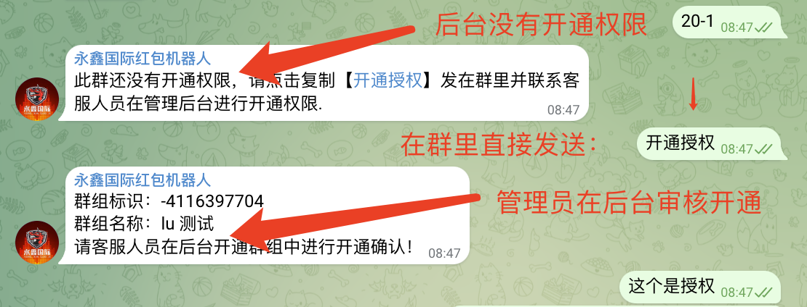
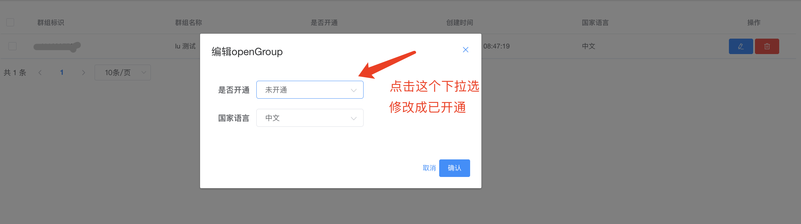

# 
# 最新版本的电报红包扫雷机器人
#### 1/玩法说明
#### 2/后台配置
#### 3/技术搭建

### 1.红包机器人玩法
    1.发包玩家 发包的格式为：
      发+金额+雷号 
      比如要发50U,雷号设置为4,则直接在娱乐群中发送：50-4 或者 50/4
      注意：发包时,发包玩家账户余额必须要大于要发的金额,如果金额不足够则需要联系机器人客服进行充值。
      
    2.抢包玩家 抢包的方式为：
      直接点击领取按钮就可以参与抢包
      注意：抢包时 抢包玩家账户余额必须要是抢的发包金额的1.8倍 这个后台可以进行修改。
      
    3.中雷规则 ： 
        抢包玩家抢到红包金额最后一位数字如果和发包玩家设定的雷值相同 
        则判定为中雷
        抢包玩家就相当于输了,需要向发包玩家赔付发包金额的1.8倍
        发包玩家就相当于赢了,系统会在发包玩家赢的金额基础上,平台会抽取5%的抽水费用
        
        抢包玩家抢到红包金额最后一位数字如果和发包玩家设定的雷值不同 
        则判定为未中雷
        抢包玩家就相当于赢了,抢包玩家白领取【赢了】的金额基础上,平台会抽取5%的抽水费用
        发包玩家就相当于输了.  
        
    4.推广返利
        私聊机器人点击个人中心按钮会有玩家个人专属推广链接信息等
        每个玩家都有自己专属的推广链接。
        推广下线的时候只需要复制链接发送给要推广的人就可以,
        
        返利规则：
          发包玩家赢的情况（有抢包玩家中雷）在所赢的金额基础上 平台抽取 %5 的抽水费用里面的 35% 会实时返现给发包玩家的上级推广人。
          抢包玩家赢的情况（领取金额没中雷）中所领取金额基础上 平台抽取 %5 的抽水费用里面的 35% 会实时返现给抢包玩家的上级推广人。

     5.开娱乐公群
         流程：
             1/使用个人电报账号建立公群
             2/将红包机器人拉进群并且设置机器人为公群的管理员
             3/即可直接在公群里面进行发红包娱乐。
             4/系统初始化用户的时候没有余额，需要联系客服在后台进行余额充值。

### 2.红包机器人后台功能介绍以及配置
    1.机器人用户管理
    2.机器人资产管理
    3.机器人红包管理
    4.机器人系统配置
    5.机器人群组授权
    
    关于机器人的只有以上菜单项是可以使用的，后台其他菜单是后台管理自带的菜单。客户无需关注其他菜单。
    
    A.机器人用户管理菜单：
            1/查看搜索公群所有参与游戏的玩家信息
            2/可以修改玩家余额 玩家信息等。一般只需要修改玩家余额就行。
                    给玩家上分：就增加玩家总金额
                    给玩家下分：就减少玩家总金额
                    设置玩家是否为机器人【玩家分为真人和机器人。机器人意思是该玩家是系统配置的自动抢包的小号】
                        1/默认系统注册的玩家都是真人
                        2/设置小号自动抢的时候必须要设置大于5个玩家为机器人才可以正常触发自动抢功能
                    设置玩家是否可以中雷：
                        1/正常：玩家正常概率中雷
                        2/中雷：玩家只要参与抢包就会一定中雷
                        3/不中：玩家只要参与抢包就一定不会中
            3/删除玩家 点击删除按钮 即可删除系统玩家。删除了后玩家在群里重新发送任何消息则机器人会重新注册玩家信息      

    B. 机器人系统配置菜单：           
            1.按钮设置
            说明：这块的按钮是机器人在聊天界面每次发包以及开奖后面跟的按钮显示，可以在后台进行添加按钮。
            添加：按钮名称+跳转链接【一般为频道链接或者个人客服链接】

    
            2.系统设置
            说明：这里的配置是机器人一些属性的配置 注意：不能修改 机器人名字 和 机器人令牌
            1.进群链接：【需要客户自己配置】私聊机器人时候-进群链接按钮-点击跳转的娱乐群链接 
            2.客服链接：【需要客户自己配置】私聊机器人时候-充值提现按钮-中联系客服的按钮链接
            3.机器人链接：【需要客户自己配置】私聊机器人时候-我的推广中玩家的推广链接，注意该链接为机器人链接需要配置客户自己机器人的链接， 例如：https://t.me/feiyu1688bot
            4.推广发包抢包盈利奖励费率：【需要客户自己配置】给推广人的奖励，比如推广人推广的下线发包抢包盈利了，平台会抽取比如盈利金额的10%，这里配置的是平台抽取的10%里面的百分比。建议配置0.35就是百分之35
            5.推广充值奖励费率：【需要客户自己配置】给推广人的奖励，推广人推广的人充值了100U，如果这里配置的0.1也就是百分之10，那么就会系统自动给推广人100U的百分之10
            6.推广奖励开关：【需要客户自己配置】推广奖励开关。默认是关闭的【no】 如果需要开启配置成【yes】只有开启了才会有给推广人的推广奖励
            7.最小发包数量：【需要客户自己配置】默认为5 这里指的时候玩家在娱乐群中发的红包金额最小限制。小于这个限制则机器人会提醒
            8.显示单位：【需要客户自己配置】 默认为U 也可以配置成USDT 或者 人民币
            9.赠送余额：【需要客户自己配置】 玩家进入娱乐群中赠送的默认金额
            0.赔率：【需要客户自己配置】 默认为1.8倍 不建议修改
            1.机器人名字【禁止修改】 这个是技术搭建的时候配置的 客户无需修改 修改后机器人就无法正常工作
            2.机器人令牌【禁止修改】 这个是技术搭建的时候配置的 客户无需修改 修改后机器人就无法正常工作
            3.可以领取的次数：【需要客户自己配置】 默认为5 意思是前端发包 可以有几个人进行抢包
            4.抢包费率：【需要客户自己配置】 默认为0.1就是百分之10 就是平台抽取抢包人盈利的百分比 比如抢包人抢了20u的包并且没有中雷，则平台抽取20的百分之10
            5.发包费率：【需要客户自己配置】 默认为0.1就是百分之10 就是平台抽取发包人盈利的百分比 比如发包人发的包有肉中雷了给赔付的金额比如是180，则平台抽取180的百分之10
            6.特殊奖励开关：【需要客户自己配置】 默认为开启【yes】 关闭则修改为【no】就行 
            7.大豹子：【只有打开特殊奖励开关才会进行奖励】 大于4位的豹子为 大豹子 比如玩家领取金额为3.333 22.22 666.6这种
            8.大顺子：【只有打开特殊奖励开关才会进行奖励】 大于4位的顺子为 大顺子 比如玩家领取金额为1.234 23.45 123.4这种
            9.小豹子：【只有打开特殊奖励开关才会进行奖励】 小于4位的豹子为 小豹子 比如玩家领取金额为3.33 22.2 666这种
            0.小顺子：【只有打开特殊奖励开关才会进行奖励】 小于4位的顺子为 大顺子 比如玩家领取金额为1.23 23.4 123.4这种
            1.自动抢包时间间隔：【不建议修改】自动抢的速度 默认速度是1秒间隔
            2.自动抢包开关：【需要客户自己配置】 默认开启【yes】 关闭为【no】 只有这块打开自动抢包的开关，在用户管理里面设置的自动抢的小号才会进行自动抢。如果打开自动抢功能则必须要设置大于5个以上的小号为机器人账号。
            3.红包封面：【需要客户自己配置】根据客户自己需求进行配置图片链接
            4.订单过期时间：【需要客户自己配置】默认为60秒 意思是如果发的包60秒内没人抢 或者 没抢完 则系统自动进行开奖并将剩余金额退回给发包人。

    C.机器人群组授权菜单
            说明：机器人拉进群并且设置管理员以后，是不能立即发包的 因为群组发包权限需要在后台开通
            机器人群组授权流程如下：
            1.群里没有开通权限的时候 发包机器人会进行提示没有进行授权
            2.然后直接在群里发送：开通授权 四个字
            3.然后管理员登录后台在机器人群组授权菜单里面就会出现一个群组记录
            4.然后编辑群组记录 修改成是否开通为：已开通 状态就可以在群里面发包玩了

### 搭建教程
        1.购买Ubuntu系统的服务器
        2.购买服务后需要安装红包系统的运行环境 

        运行环境安装流程：
            1.登录服务器SSH到命令窗口
                购买的服务器；都会通过SSH连接到服务器命令窗口。默认的ssh端口是22端口。链接ssh的时候需要下载ssh工具 这个自行百度。
                再ssh工具中通过购买的Ubuntu服务器IP 和 用户名 密码 进行链接登录到远程服务器。
            2.链接服务器成功后需要安装下面到一些运行环境。    
            3.安装宝塔服务器管理面板 ； 复制下面的安装脚本
                wget -O install.sh https://download.bt.cn/install/install-ubuntu_6.0.sh && sudo bash install.sh ed8484bec
                复制后在你的ssh链接的远程服务器命令窗口直接粘贴 然后回车就会自动安装 安装过程中需要你输入y进行确认安装。
            4.宝塔安装成功后会有访问宝塔的http链接地址和用户名密码。然后复制访问链接地址到你的浏览器中进行访问登录面板。
            5.面板登录成功后，需要创建红包数据库。点击面板左边菜单 【数据库】 - 添加数据库 - 设置数据库名 用户名 用户密码；如下图：
            
            6.安装redis。
                在宝塔面板中左边菜单找到软件商店。搜索框搜索redis然后点击进行安装;
                安装成功后需要更改redis默认的配置文件，还是在软件商店中已经安装的里面找到redis。
                点击后面配置按钮，在配置里面找到配置文件然后在配置文件里面搜索：notify-keyspace-events
                将notify-keyspace-events的值 配置成“Ex” ； 默认是“”。如下配置：
               
                #  By default all notifications are disabled because most users don't need
                #  this feature and the feature has some overhead. Note that if you don't
                #  specify at least one of K or E, no events will be delivered.
                notify-keyspace-events "Ex"

                然后保存，重启redis就可以了。
                
                

            7.安装kafka 复制下面下载地址。
                wget https://downloads.apache.org/kafka/3.6.1/kafka_2.13-3.6.1.tgz
                复制后在服务器命令行中【ssh登录的命令窗口】直接粘贴回车会下载一个软件包
                然后复制下面命令解压这个软件包： 
                tar -zvxf kafka_2.13-3.6.1.tgz
                解压成功后会在同目录里面有个解压出来的包。然后进入这个包里的bin目录 复制下面命令然后回车：
                cd kafka_2.13-3.6.0/bin/ 
                进入bin目录后，需要启动kafka 复制下面启动命令：
                先启动zk 等启动成功后 。在复制第二个命令启动kf下面是两个命令哦。
                nohup ./zookeeper-server-start.sh ../config/zookeeper.properties > zk.log 2>&1 &
                nohup ./kafka-server-start.sh ../config/server.properties > kf.log 2>&1 &

            8.安装java jdk 复制下面的命令：
                命令1更新软件包
                命令2安装jdk
                命令3验证jdk是否安装成功。
                
                sudo apt update
                sudo apt install openjdk-11-jdk
                java -version

            9.启动红包程序：上面所有安装成功后 。接下来就是启动红包程序了。【找客服要打包好的运行包】
                1.在服务器里面创建个bots文件夹，下面命令：
                    mkdir bots
                2.将红包运行包上传到上面创建好的bots文件夹里面；
                    登录宝塔面板-在左边菜单中找到【文件】菜单。点击文件菜单，然后在文件里面找到上面创建的bots文件夹。
                    然后上传运行包到这个文件夹里面。
                3. 回到ssh服务器命令窗口。
                    使用ls查看该文件夹里面运行包是否上传成功
                    使用下面命令启动红包程序：
                        nohup java -jar bot-red-0.0.1-SNAPSHOT.jar & 
                    使用下面命令查看启动日志
                        tail -f nohup.out
                    使用下面命令退出查看启动日志
                        control + c

            10.如果红包程序出问题或者因为服务器等原因卡住。可以尝试重启红包程序进行修复。
                    重启之前需要杀掉之前启动的进程
                    在创建的bots文件夹中使用下面命令进行查看：
                        ps -ef | grep bot-red-0.0.1-SNAPSHOT.jar
                    会出现下面的进程号：
                        root@ubuntu:~/bot/red-bot/v1# ps -ef | grep bot-red-0.0.1-SNAPSHOT.jar 
                        root     1331160       1  0  2023 ?        02:17:37 java -jar bot-red-0.0.1-SNAPSHOT.jar
                        root     2490762 2489997  0 10:54 pts/0    00:00:00 grep --color=auto bot-red-0.0.1-SNAPSHOT.jar
                    杀掉这个进程 一般是第一个就是当前程序的进程号 使用下面命令：
                        kill -9 1331160 
                    杀掉后就可以重启启动红包程序了；使用下面命令启动红包程序：
                        nohup java -jar bot-red-0.0.1-SNAPSHOT.jar & 
                    使用下面命令查看启动日志
                        tail -f nohup.out
                    使用下面命令退出查看启动日志
                        control + c
                
         