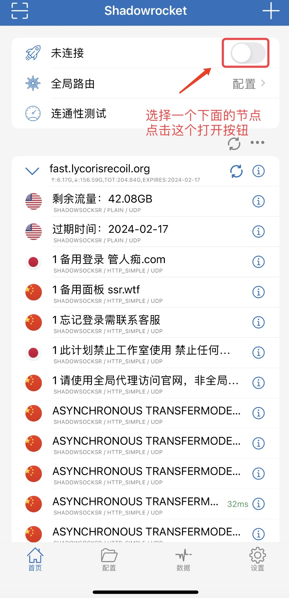

# 亿贝元宇宙科技
 

### 苹果用户： 
        1.下载翻墙工具【小火箭Shadowrocket】
            这里需要苹果海外ID 并且海外ID已经付费购买了该APP 【APP官方收费的】
            现在推荐个购买海外ID的商家 自己加商家进行购买使用
            a.购买后的海外苹果StoreID后打开苹果商店 注意⚠️不要在设置里面登录该ID 有被远程锁定的风险
            b.打开苹果商店后 退出你当前的苹果账号 登录你购买的账号
            c.登录成功后会跳转到海外市场 然后在里面搜索shadowrocket下载安装
            d.安装成功后在手机上打开APP 然后点击首页右上角的 ➕ 号
            e.会跳转到添加节点的页面； 【类型】选择 Subscribe。 【URL】复制粘贴输入下面地址
            【订阅链接地址】https://fast.lycorisrecoil.org/link/340sfCCxRNPbu32x?sub=1
            f.然后点击保存回到首页， 即可看到很多节点服务器；点击第一个链接按钮打开即可。类似下面图片效果

 

# 如果订阅链接一直拉去不下来翻墙服务器的话 
    
        1.如果一直订阅不成功的话 
        2.全选复制下面我们准备好的服务器节点地址 
        3.然后回到手机上的小火箭会自动弹出从剪贴板导入
        4.然后点击从剪贴板导入即可

#### 所有服务器节点

链接地址 ： https://github.com/yishellmeta/technical-problem/blob/main/Vpn/static/text/all.txt
 
    
        

